# 2022 裝修

# 目錄

1. [圖則](#building_plans)
1. [油漆](#paint)
1. [家電](#appliances)
1. [智能電掣](#smartswitch)
1. [弱電設計](#datacabling)
1. [書房(BR1)](#br1)
1. [小童房(BR2)](#br2)

## 圖則

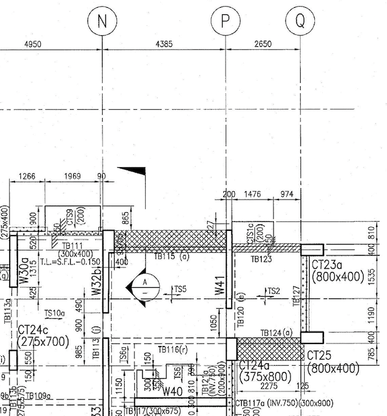

## 油漆
[立邦](https://www.nipponpaint.com.hk/inspiration.php?tab=interior_link)

## 家電

- 雪櫃
    - Mitsubishi 三菱 MR-C46C 三門雪櫃
    - 外型尺寸(亳米)[]
        - 高	  1798
        - 闊	  600
        - 深	  666
    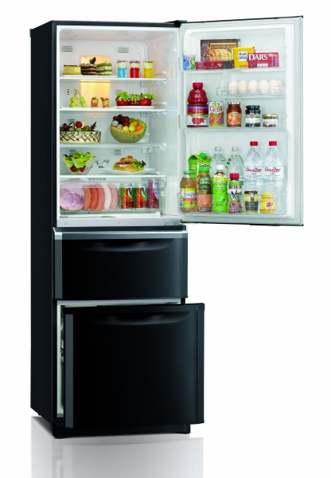

- 電腦機櫃(待定)
    - [SharkRack S5-64509](https://detail.tmall.com/item.htm?id=644104705620&ali_trackid=2:mm_1544500114_2165950113_111725950422:1646579126_157_696542815&union_lens=lensId:TAPI@1646579060@21334aca_085e_17f5fc28eb5_5cf6@01;recoveryid:1646579126_157_696542815&spm=a21wu.12321156-tw.rate-area.1&ak=33360074&bxsign=tbkbSJm/bywxgEupFv%20/81GIQ2Ph2ms0yDSk9MIj6zOOhry3Re64/tIkI7PHeqA0gZyu9rcASPYjyead4jHHsqItzTao%20z0hg8AykLLHNyCzHU=&skuId=4808815786406)
    - 尺寸(亳米)
        - 高	  540
        - 闊	  600
        - 深	  450
    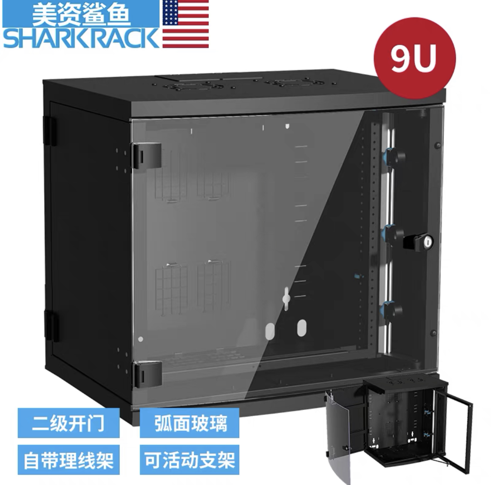

- 熱水爐
  - 型號: TGC TRJW221TFQL
  - 耗電量: 3A
  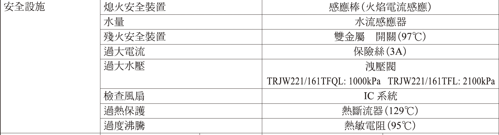

## 智能電掣

- 牆壁開關
  - 型號
    - 1-2鍵：[Aqara 智能牆壁開關 E1](https://www.aqara.com/cn/productDetail/smart-wall-switch-e1)
    - 3鍵：[Aqara 智能牆壁開關 D1](https://www.aqara.com/cn/productDetail/d12) ** 厚度較高 **
  - 使用Zigbee協議，無需使用Wifi網絡
  - 單火版（沒有零線）的限制：不能作訊號中繼。零火版（有零線）則可以。
  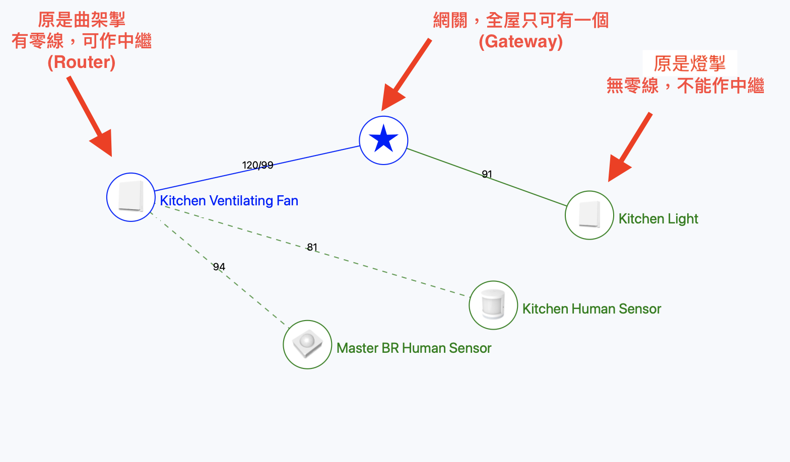
  - 網關設於書房(BR1)

## 弱電設計

### 音響

- 電視和梳化之間穿surround喇叭綫嘅位。一個位，兩條25喉。

### 網線

- 光籤
  - 寬頻
  - LAN
  - KVM

  // Work in progress
  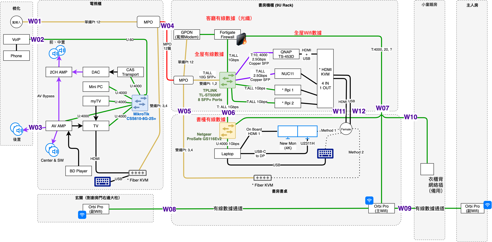
  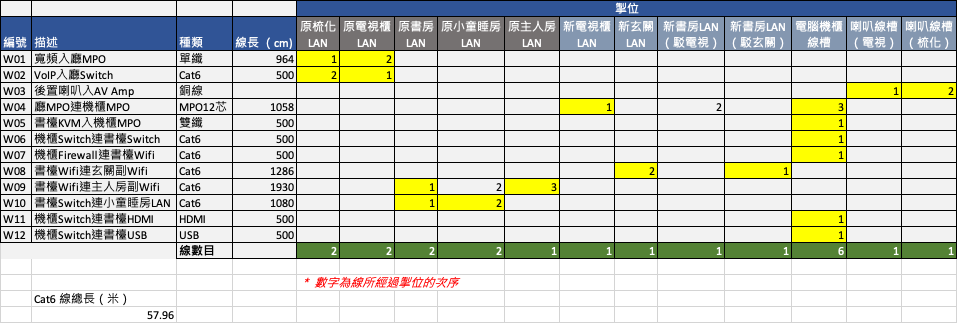

## 書房(BR1)

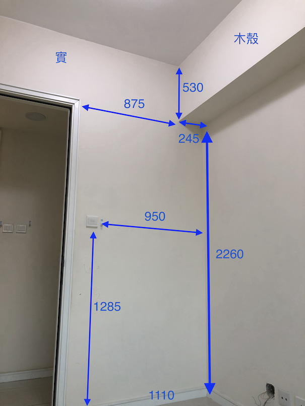
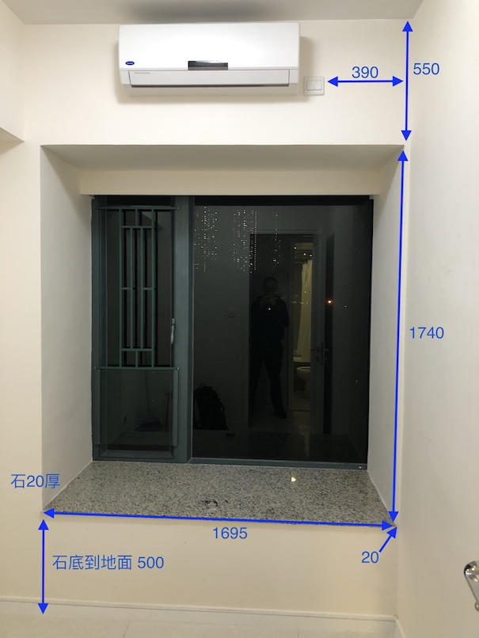
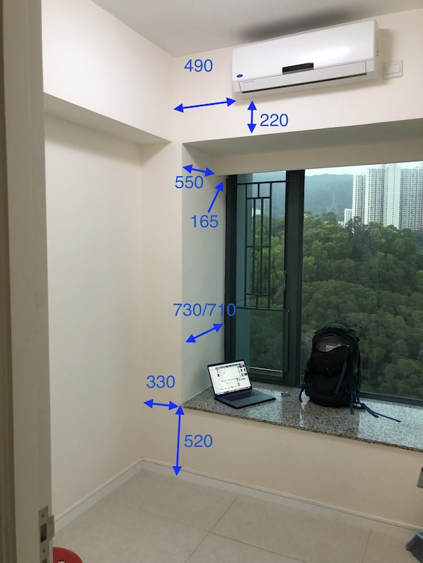
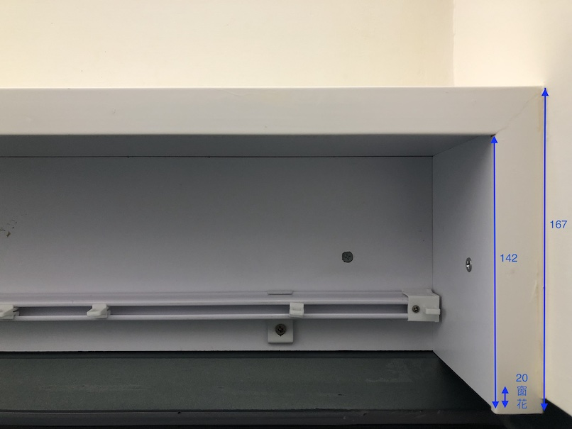
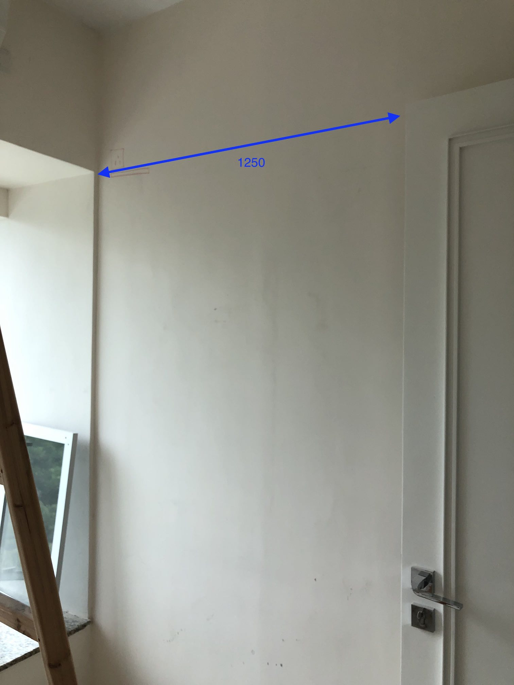

## 小童房(BR2)
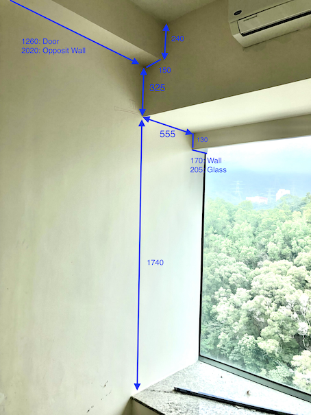

