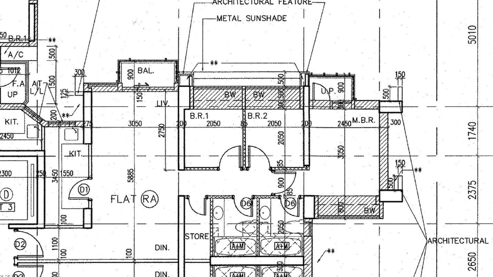

# 2022 裝修

# 目錄
1. [圖則](#building_plans)
2. [智能電掣](#smartswitch)
3. [弱電設計](#datacabling)
3. [書房(BR1)](#br1)

## 圖則

## 智能電掣

- 牆壁開關
  - Aqara 智能牆壁開關 E1
  - 使用Zigbee協議，無需使用Wifi網絡
  - 單火版（沒有零線）的限制：不能作訊號中繼。零火版（有零線）則可以。
  
  - 網關設於書房(BR1)

## 弱電設計

## 書房(BR1)

